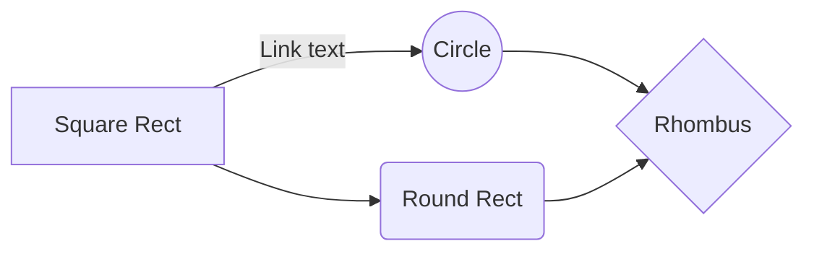
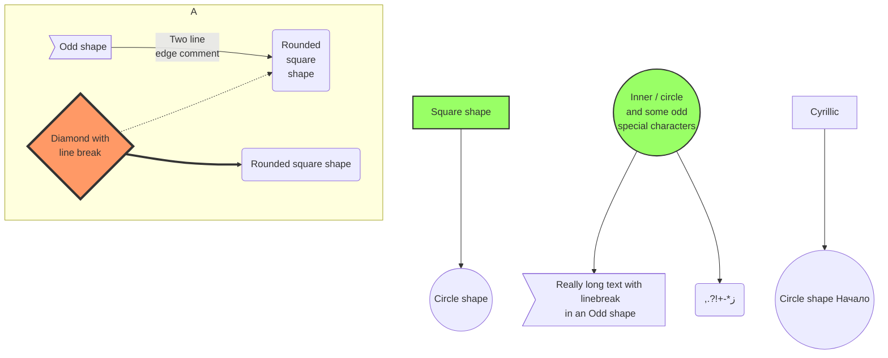
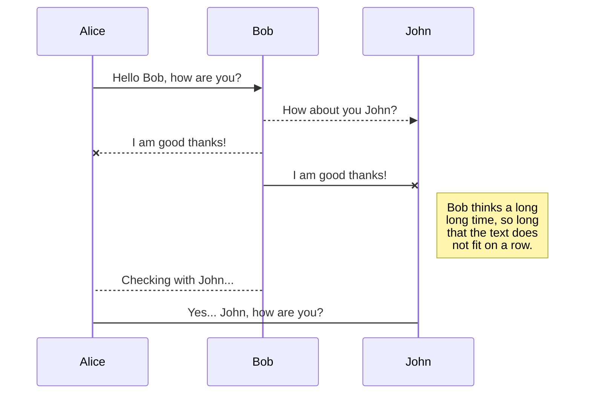

# Diagrams

## Mermaid

A graph:

```mermaid
graph LR
    A[Square Rect] -- Link text --> B((Circle))
    A --> C(Round Rect)
    B --> D{Rhombus}
    C --> D
```

A styled graph:

```mermaid
graph TB
    sq[Square shape] --> ci((Circle shape))

    subgraph A
        od>Odd shape]-- Two line<br/>edge comment --> ro
        di{Diamond with <br/> line break} -.-> ro(Rounded<br>square<br>shape)
        di==>ro2(Rounded square shape)
    end

    %% Notice that no text in shape are added here instead that is appended further down
    e --> od3>Really long text with linebreak<br>in an Odd shape]

    %% Comments after double percent signs
    e((Inner / circle<br>and some odd <br>special characters)) --> f(,.?!+-*ز)

    cyr[Cyrillic]-->cyr2((Circle shape Начало));

     classDef green fill:#9f6,stroke:#333,stroke-width:2px;
     classDef orange fill:#f96,stroke:#333,stroke-width:4px;
     class sq,e green
     class di orange
```

A sequence diagram:

```mermaid
sequenceDiagram
    Alice ->> Bob: Hello Bob, how are you?
    Bob-->>John: How about you John?
    Bob--x Alice: I am good thanks!
    Bob-x John: I am good thanks!
    Note right of John: Bob thinks a long<br/>long time, so long<br/>that the text does<br/>not fit on a row.

    Bob-->Alice: Checking with John...
    Alice->John: Yes... John, how are you?
```